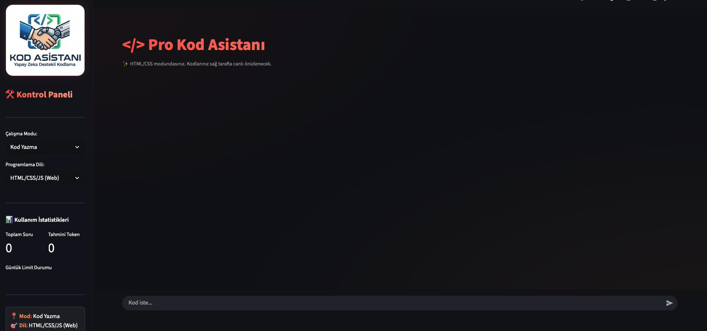
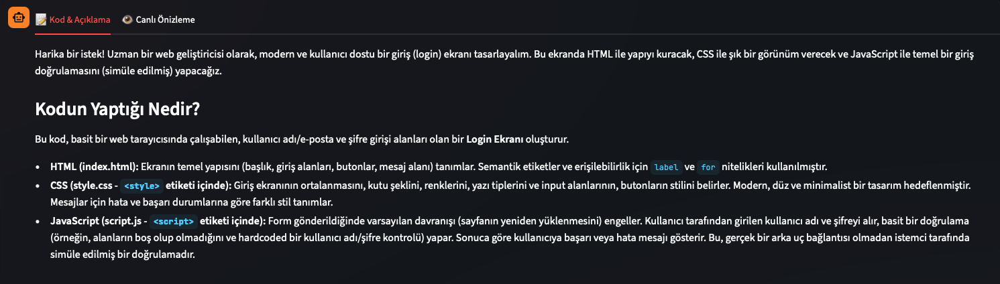
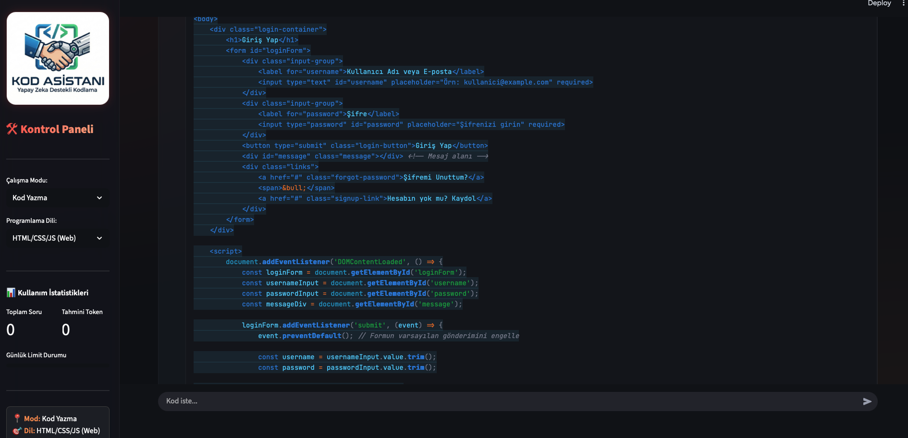
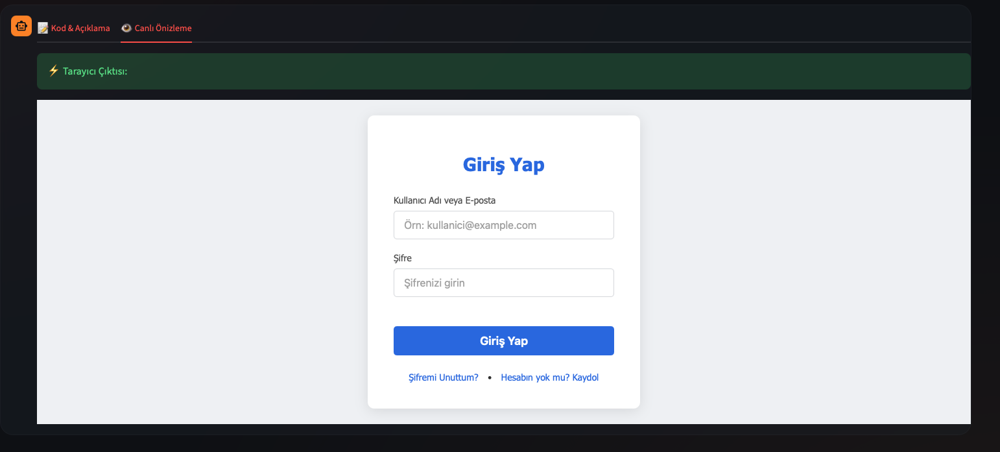
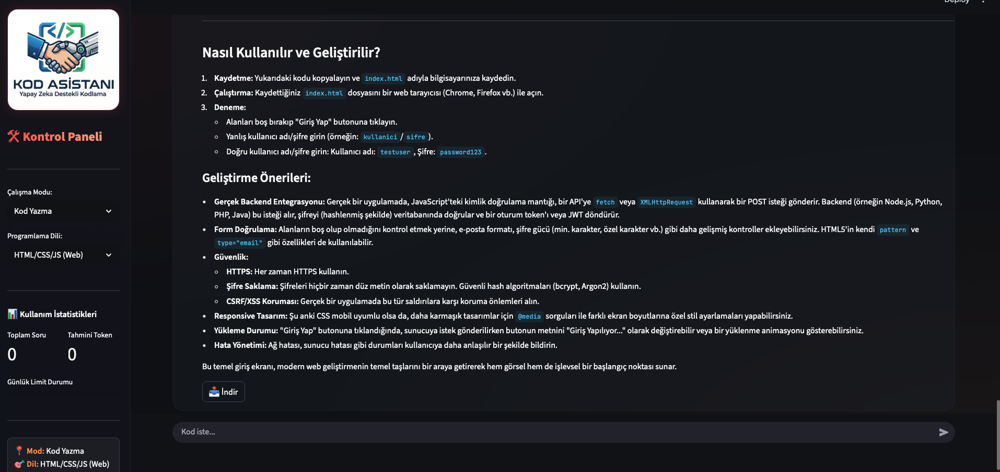

# 💻 Pro Kod Asistanı

**Pro Kod Asistanı**, yazılım geliştirme süreçlerini hızlandırmak ve kodlama eğitimini desteklemek amacıyla geliştirilmiş, **Google Gemini 2.5 Flash AI** tabanlı gelişmiş bir asistan uygulamasıdır. 

Kullanıcılar; kod yazma, hata ayıklama ve kod açıklama modları arasında geçiş yaparak projelerini geliştirebilir, yazdıkları web kodlarını anlık olarak önizleyebilirler.

---

## 🧭 Özellikler

- 🤖 **Üç Temel Çalışma Modu:**
  - **Kod Yazma:** İhtiyacınız olan fonksiyonu veya yapıyı sıfırdan oluşturur.
  - **Hata Ayıklama (Debug):** Mevcut kodunuzdaki hataları bulur ve düzeltilmiş halini sunar.
  - **Kod Açıklama:** Kodun her satırını detaylıca analiz ederek mantığını öğretir.

- 🌐 **Canlı Web Önizleme (Live Preview):**
  HTML, CSS ve JavaScript kodlarını uygulama içerisindeki entegre tarayıcıda anlık olarak görüntüler ve test etmenizi sağlar.

- 📥 **Akıllı Dosya İndirme:**
  Üretilen çözümleri; `.py`, `.cs`, `.dart`, `.java`, `.cpp` gibi ilgili programlama dilinin dosya uzantısıyla tek tıkla indirebilirsiniz.

- 📊 **Kullanım İstatistikleri:**
  Seans boyunca harcanan tahmini token miktarını ve soru sayısını görsel metriklerle takip etme imkanı sunar.

---

## 🖼️ Ekran Görselleri

<table>
  <tr>
    <th>Ana Arayüz (Kontrol Paneli)</th>
    <th>Kod & Açıklama</th>
    <th>Kod Editörü</th>
  </tr>
  <tr>
    <td></td>
    <td></td>
    <td></td>
  </tr>
</table>

<br>

<table>
  <tr>
    <th>Canlı Önizleme (Tarayıcı Çıktısı)</th>
    <th>Nasıl Kullanılır ve Geliştirilir?</th>
  </tr>
  <tr>
    <td></td>
    <td></td>
  </tr>
</table>


---

## 🛠️ Kullanılan Teknolojiler

| Teknoloji | Açıklama |
|------------|----------|
| **Python** | Uygulamanın ana programlama dili |
| **Streamlit** | Modern ve hızlı web arayüzü framework'ü |
| **Gemini 2.5 Flash** | Google'ın yeni nesil yüksek performanslı yapay zeka modeli |
| **Custom CSS** | Glassmorphism ve Dark Mode odaklı görsel tasarım |
| **Dotenv** | Güvenli API anahtarı yönetimi |

---

## 🧩 Proje Yapısı

    pro-kod-asistani/
    │
    ├── app.py              # Ana uygulama akışı ve Streamlit arayüzü
    ├── logic.py            # Gemini API entegrasyonu ve yardımcı fonksiyonlar
    ├── style.css           # Uygulamanın görsel kimliğini belirleyen CSS
    │
    ├── image/              # Uygulama içinde kullanılan logo ve ikonlar
    │   └── kodasistani.png
    │
    ├── .env                # API Anahtarı (Gizli tutulmalıdır)
    └── requirements.txt    # Gerekli Python kütüphaneleri listesi

---

## 🚀 Kurulum ve Çalıştırma

1. **Depoyu Klonlayın:**
  ```bash
   git clone https://github.com/Deniz-Kmr/Kod_Asistani.git
   cd Kod_Asistani
  ``` 

2. **Bağımlılıkları Yükleyin:**  
  ```
   pip install streamlit google-generativeai python-dotenv
  ```
3. **API Anahtarını Tanımlayın:**
  ```   
   API_KEY=SİZİN_API_ANAHTARINIZ
  ```
4. **Çalıştırın:**
  ```
   python3 -m streamlit run app.py
  ```
---

## 🎓 Akademik Atıf

Bu proje, **Mühendislikte Bilgisayar Uygulamaları** dersi kapsamında geliştirilmiş bir dönem projesidir. Yapay zeka destekli yazılım asistanlarının geliştirme verimliliği üzerindeki etkilerini incelemek amacıyla tasarlanmıştır.

Geliştirici: **Deniz Çelik** 

Geliştirici: **Mehmet Ali Özberk**

Bölüm: **Bilgisayar Mühendisliği**

Danışman: **Halil İbrahim Okur**